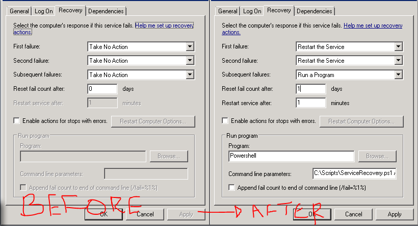

ServiceRecovery
===============

Batch configure the Service Recovery Options for Windows Servers. Will email upon subsequent failures.

To update servers:
```powershell
[PS]>ServiceRecovery.ps1 Install # Update Servers
[PS]>ServiceRecovery.ps1 Alert -Service ServiceName # Send an alert RE: ServiceName
```
